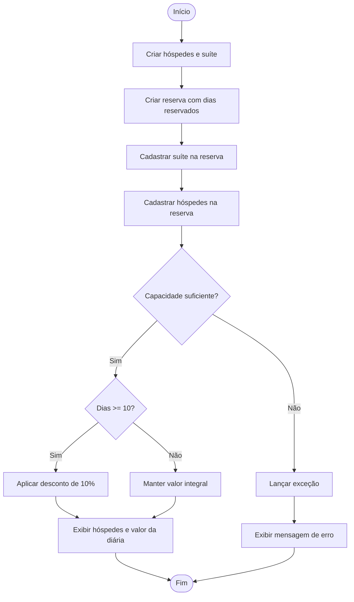

# 🏨 Sistema de Hospedagem

Desafio de projeto da **Trilha .NET - DIO**, implementado como parte do módulo de exploração da linguagem C#.

> ⚠️ Projeto desenvolvido como solução de um desafio proposto pela DIO. O código base foi fornecido pela instituição e a implementação da lógica de negócio foi desenvolvida como exercício prático.

---

## 📋 Contexto

Sistema de reservas de hotel com relacionamento entre hóspedes, suítes e reservas. O programa calcula o valor da diária com base nos dias reservados, aplicando desconto para estadias mais longas.

---

## ✅ Regras implementadas

- Validação de capacidade da suíte — não é possível reservar para mais hóspedes do que a suíte comporta
- Cálculo do valor total: `DiasReservados × ValorDiaria`
- Desconto de **10%** para reservas iguais ou maiores que 10 dias
- Tratamento de exceção com mensagem amigável ao usuário

---

## 🧠 Conceitos praticados

- Classes e propriedades (`Pessoa`, `Suite`, `Reserva`)
- Relacionamento entre classes
- Construtores com sobrecarga
- Tratamento de exceções (`try/catch` e `throw`)
- Listas (`List<T>`)
- Expressões com `decimal`

---

## 📁 Estrutura do projeto

```
DesafioSistemaHotel/
├── Models/
│   ├── Pessoa.cs    # Representa o hóspede
│   ├── Suite.cs     # Representa a suíte do hotel
│   └── Reserva.cs   # Relaciona hóspedes e suíte + lógica de negócio
├── Program.cs        # Entrada do programa
└── README.md
```

---

## 🔄 Fluxo da aplicação



---

## ▶️ Como rodar

**Pré-requisitos:** .NET SDK instalado

```bash
git clone https://github.com/TerencioFonseca/DesafioSistemaHotel.git
cd DesafioSistemaHotel
dotnet run
```

---

## 🛠️ Tecnologias

- C# / .NET
- Programação Orientada a Objetos

---

## 🔗 Repositório original

Desafio proposto pela [Digital Innovation One](https://github.com/digitalinnovationone/trilha-net-explorando-desafio)
